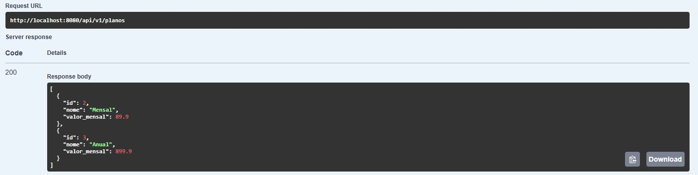

# APi Rest de Gestão de Academia 

API REST desenvolvida Spring Boot 3 para gerenciar uma academia, permitindo o controle de alunos, planos, treinos, pagamentos e vínculos entre alunos e treinos.

---

## Tecnologias Utilizadas:

- **Java 21**
- **Spring Boot 3.5.6**
- **Spring Data JPA**
- **H2 Database**
- **Springdoc OpenAPI (Swagger UI)**
- **Maven**

---

## Estrutura do Projeto:

---

## Instruções para Rodar o Projeto:

1. Clone o repositório.
2. Entre no diretório do projeto.
3. Instale as dependências e compile o projeto
4. Execute a aplicação

Ou rode diretamente na IDE clicando em Run → GestaoDeAcademiaApplication

## A aplicação utiliza o banco H2 em modo arquivo, criado automaticamente na pasta /data.

## Após iniciar o projeto, acesse a documentação interativa pelo Swagger UI:

http://localhost:8080/swagger-ui.html

Lá é possível testar todos os endpoints diretamente e visualizar todos os endpoints principais. 

## Descrição da Solução:

O sistema foi projetado para gerenciar de forma eficiente os principais aspectos de uma academia, com foco em:

- Gerenciamento de Alunos (cadastro, status ativo/inativo, vínculo a plano)
- Controle de Planos (nome e valor mensal)
- Cadastro de Treinos (nome, descrição e nível de dificuldade)
- Gestão de Pagamentos (forma de pagamento, status e valor)
- Associação Aluno-Treino, permitindo registrar quais alunos estão em quais treinos.

## Printscreen dos endpoints testados: 

### Criar Plano

### Buscar Planos

### Criar Aluno

### Criar Pagamento

### Criar Treino

### Atualizar Treino

### Vincular Aluno e Treino

---

## Autora

Marya Laura Menezes
maryalaura1307@gmail.com
